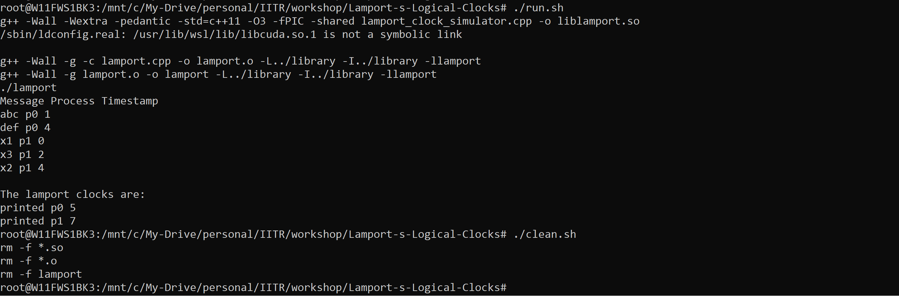

# Problem statement
[Link to PDF](assets/problem_statement.pdf)

# Lamport’s logical clocks
A Lamport logical clock is a numerical software counter value maintained in each process. Conceptually, this logical clock can be thought of as a clock that only has meaning in relation to messages moving between processes. When a process receives a message, it re-synchronizes its logical clock with that sender.

### Algorithm
- Happened before relation(->): a -> b, means ‘a’ happened before ‘b’.
- Logical Clock: The criteria for the logical clocks are:
  - [C1]: Ci (a) < Ci(b), [ Ci -> Logical Clock, If ‘a’ happened before ‘b’, then time of ‘a’ will be less than ‘b’ in a particular process. ]
  - [C2]: Ci(a) < Cj(b), [ Clock value of Ci(a) is less than Cj(b) ]

## Code Execution - How to run the code
- Run the below command to make the files executable</br>
```chmod 777 run.sh clean.sh``` 

- Run the below command with the file name run.sh to perform the operations i.e Install, compile and run </br>
```[./run.sh]```

- Run the below command with the file clean.sh to clean the library and examples folder</br>
```[./clean.sh]``` 

## Sample Input

```
    begin process p1
    send (p2) m1
    print abc
    print def
    end process

    begin process p2
    print x1
    recv p1 m1
    print x2
    send (p1) m2
    print x3
    end process p2
```

## Sample Output


```
Type Process Message Timestamp

begin process p1 p0  0
print abc p2  0
print x1 p1  0
end process p2 p0  0
print x3 p5  0
send (p1) m2 p4  0
print x2 p3  0
begin process p2 p0  0
recv p1 m1 p2  0
end process p0  0
send (p2) m1 p1  0
print def p3  0
system deadlocked
printed p0 0
printed p1 0
printed p2 0
printed p3 0
```

## Results - Execution Output


## Conclusion

Lamport's logical clocks are a powerful tool for reasoning about the concurrent execution of processes. They can be used to detect deadlocks and other concurrency errors.

The output obtained is based on the input provided. The system is deadloacked because the process 0 is waiting or a 
message from the process 1, and process 1 is waiting for the message from process 0

One way to avoid deadlock in this example is to change the order of the events in process 1. For example, process 1 could send message m2 to process 0 before receiving message m1 from process 0. This would allow process 0 to continue executing, even if process 1 is blocked waiting for message m1.

Another way to avoid deadlock is to use a different synchronization algorithm, such as mutual exclusion. Mutual exclusion algorithms allow processes to take turns accessing shared resources, which can help to prevent deadlock.

Here is an example of how to change the order of the events in process 1 to avoid deadlock:
```
begin process p2
print x1
send (p1) m2
recv p1 m1
print x2
print x3
end process p2
```
With this change, the system will no longer deadlock, and the output will be as follows:

```
begin process p1 p0  0
print x1 p1  0
print abc p2  0
send (p2) m2 p3  0
print def p4  0
end process p0  0
print x2 p5  0
recv p1 m1 p2  0
print x3 p6  0
end process p2 p0  0
printed p0 0
printed p1 0
printed p2 0
```